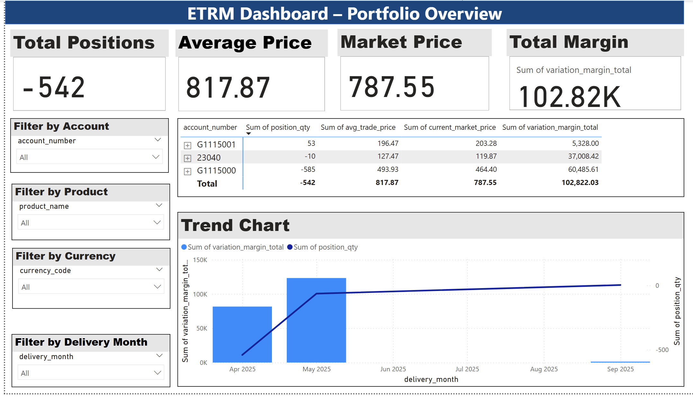
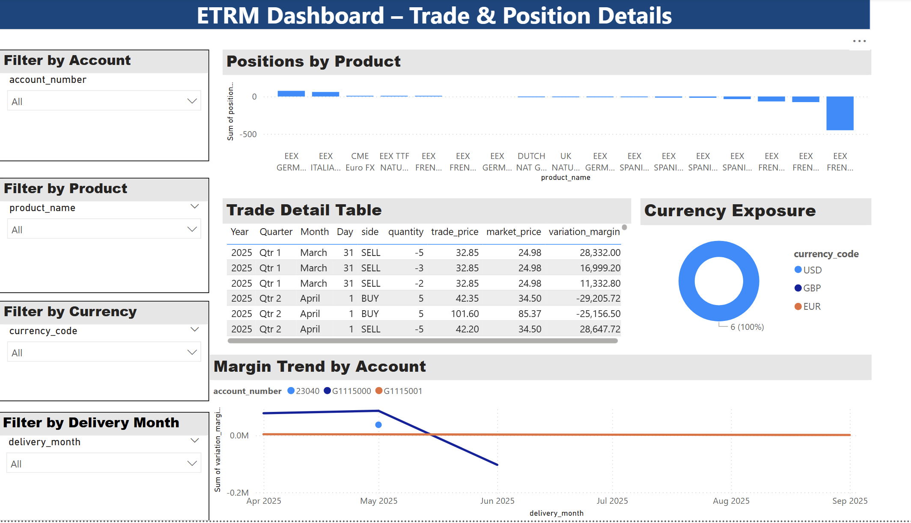
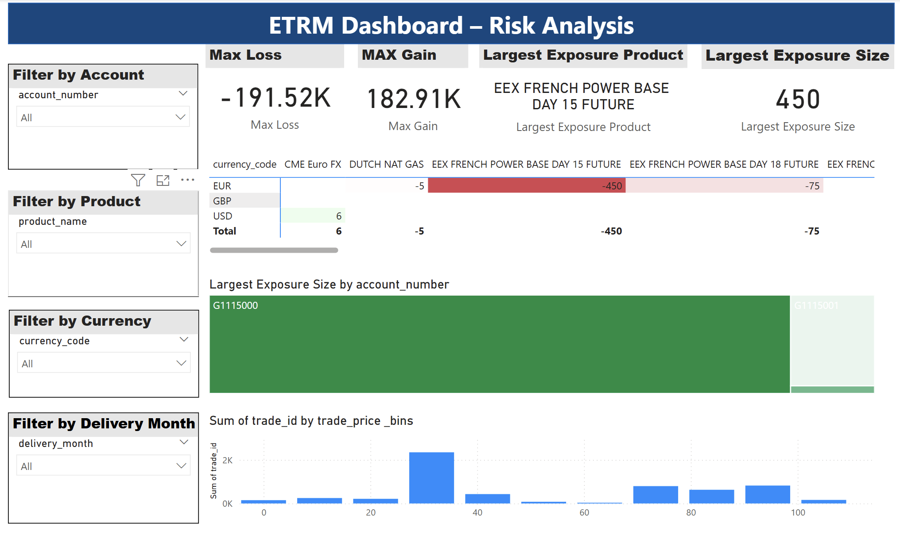

# ETRM Case Study  


Prototype trade ingestion and monitoring system built as part of the ETRM Developer case study. 

## 📂 Project Structure  
- **etl/** → Python scripts for loading and normalizing broker trades  
- **sql/** → Schema and views (SQLite compatible)  
- **powerbi/** → Power BI report files (`.pbix`)  
- **exports/** → Sample output files / exports  
- **data/** → Raw input files (e.g., broker positions)
  
```
ETRM_CASE_STUDY/
│── db/ # Database schema + views
│ ├── schema.sql
│ ├── views_positions.sql
│ └── reset.sql
│
│── etl/ # ETL scripts for loading trades
│ ├── load_broker_a_positions.py
│ ├── load_broker_b_positions.py
│ └── normalize.py
│
│── sql/ # Additional SQL scripts
│── exports/ # Sample exports (optional small files only)
│── Broker A Open Positions.csv # Sample input
│── Broker B Open Positions.csv # Sample input
│── requirements.txt # Python dependencies
│── README.md # This file
│── .gitignore # Ignoring venv, DB, pbix, etc.
```

## 🚀 Phase 1 Deliverables  
- ✅ Data ingestion & normalization with SQLite  
- ✅ Trade & position aggregation (`views_positions.sql`)  
- ✅ Power BI dashboards  
  - Portfolio Overview  
  - Trade & Position Details  
  - Risk Dashboard  

## 📊 Outputs  
- **ETRM_Report.pdf** – exported dashboard PDF  
- **ETRM_Report.pbix** – interactive Power BI file  

## ▶️ Setup Instructions
1. Clone Repo
```
git clone https://github.com/feizhai39/etrm-case-study.git
cd etrm-case-study
```
2. Create Virtual Environment
```
python3 -m venv .venv
source .venv/bin/activate   # Mac/Linux
.venv\Scripts\activate      # Windows
```
3. Install Dependencies 
```
pip install -r requirements.txt
```
## 🗄️ Database Setup (SQLite)

1. Create database + schema:
```
sqlite3 etrm.db < db/schema.sql
```
2.Load raw data into SQLite using scripts in **etl/**.
```
python etl/load_broker_a_positions.py
python etl/load_broker_b_positions.py
```
3. Create reporting view:
```
sqlite3 etrm.db < db/views_positions.sql
```
## 📊 Power BI Dashboard

- Open powerbi/ETRM_Report.pbix in Power BI Desktop.

- Data source is set to etrm.db (SQLite).

- Report contains 3 pages:

1. **Portfolio Overview/** → KPIs + Trend

2. **Trade & Position Details/** → Positions by Product, Currency Exposure

3. **Risk Dashboard/** → Max Loss/Gain, Exposure Heatmap, Distribution

⚠️ If the `.pbix` file exceeds GitHub limits, please request the PBIX file via email as instructed.


## 📈 Example Outputs
**Portfolio Overview**


- Total Positions, Avg Price, Market Price, Total Margin

- Trend Chart (Variation Margin & Position Qty over Delivery Month)

**Trade & Position Details**


- Positions by Product

- Currency Exposure (donut chart)

- Margin Trend by Account

**Risk Dashboard**


- Max Loss, Max Gain, Largest Exposure Product/Size (cards)

- Heatmap (Product vs Currency)

- Histogram (Trade Price Distribution)

- Daily P&L Trend
## 🚀 How to Run End-to-End
```
# 1. Reset + create schema
sqlite3 etrm.db < db/reset.sql

# 2. Load broker files
python etl/load_broker_a_positions.py
python etl/load_broker_b_positions.py

# 3. Create reporting views
sqlite3 etrm.db < db/views_positions.sql

# 4. Open Power BI file → refresh data

```
## ✅ Deliverables Checklist

- ✅ SQL Schema + Views

- ✅ ETL Scripts for Broker A & B

- ✅ Sample CSV Input Files

- ✅ Power BI Dashboard (.pbix / PDF Export)

- ✅ README.md with setup + instructions

## ⚙️Tech Stack
**Python (ETL)/**

**SQLite (database)/**

**Power BI (reporting)/**

🔗 Repo: [etrm-case-study](https://github.com/feizhai39/etrm-case-study/)
